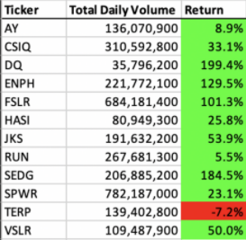
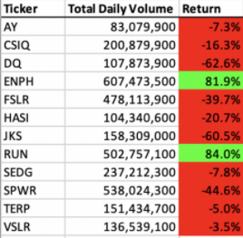

# **Steve's Stock Analysis Tool**

## **Overview of Project**
  - ### Purpose - The purpose of this project is to create a tool for Steve to analyze stock daily volume and yearly return.  He will use this information to assist his parents with their investment strategy.  Although Steve originally focused his efforts on green stocks, he wants the option to anlyze all types of stocks over the last few years.  Specifically for this portion of the project, I will refactor the original code I provided Steve with the intention of making the VBA script run faster and more efficiently while keeping the same analysis functionality and output.

## **Results**
  - ### Stock Performance Comparison - Steve would like this tool to calculate the total daily volume and yearly return for each stock to get a better idea of what stocks he will advise his parents to invest in. According to Module 2 material:
  
   > Daily volume is the total number of shares traded throughout the day; it measures how actively a stock is traded. And the yearly return is the percentage difference in price from the beginning of the year to the end of the year.
 
   - **2017 Stock Analysis:**

        
  
   - **2018 Stock Analysis:**

      

   - Referring to the tables above, you'll see the total daily volumes and yearly returns of the green stocks that Steve originally wanted analyzed.  In 2017, the returns for these stocks, with the exception of TERP (-7.2%), were positive; however, in 2018, many of the stocks' returns drop drastically, with the exception of ENPH (+81%) and RUN (+84%).  This obviously led to Steve's desire to diversify his anlysis to include other types of stock to find a wiser investment direction for his parents.

  - ### Script Execution Time - In the future, Steve may want to perform his analysis on larger datasets so he wanted to know how fast his VBA code will compile the results. I refactored the orignal code to make it run more efficiently.  As you can see by the following screen shots, the refactored script's execution time is lower than the original script.  As I continue to run the refactored code, the execution time seems to become quicker and more efficient.

    - Refactored Code Execution Time
          
        
    
        
      
      - Some examples of how I refactored the code to make it run more efficiently include:
        a) creating a ticker index: `Dim tickerIndex As String tickerIndex = tickers(0)`,
        b) creating output arrays for ticker volume, starting price, and ending prices:  `Dim tickerVolumes(12) As Long Dim tickerStartingPrices(12) As Single Dim tickerEndingPrices(12) As Single`
        c) creating a For loop to initialize the arrays to zero: `For i = 0 To 11 tickerIndex = tickers(i) tickerVolumes(i) = 0 tickerStartingPrices(i) = 0 tickerEndingPrices(i) = 0`,
        d) creating a for loop to loop through all rows ` For j = 2 To RowCount`  One example in this for loop of how I increaded the volume for the current ticker is `If Cells(j, 1).Value = tickerIndex Then tickerVolumes(i) = tickerVolumes(i) + Cells(j, 8).Value End If`, and 
        e) creating a For loop to loop through the arrays and output the ticker, total daily volume, and return. `For i = 0 To 11 Worksheets("All Stocks Analysis").Activate Cells(4 + i, 1).Value = tickers(i) Cells(4 + i, 2).Value = tickerVolumes(i) Cells(4 + i, 3).Value = tickerEndingPrices(i) / tickerStartingPrices(i) - 1`
  
    - Original Code Exection Time 
        
       
       
       
  
## **Summary**
### Advantages or Disadvantages of Refactoring Code
- One advantage of refactoring might be that the coder is able to improve the efficiency of the code.  
    -  Three examples given in Module 2 of how code can be made more efficient include:
      
      > taking fewer steps, using less memory, or improving the logic of the code to make it easier for future users to read.
      
    -  In this project, blah blah
 - Possible disadvantages might be the opposite of what was just mentioned.  If you are not the original author of the code, you may spend more time attempting to become familiar with the code or you may not have the background.  Perhaps the original coder might have scripted the code in what appears to be a more efficient way, and it didn't create the same output.
### Application of Refactoring Original Script
There is a detailed statement on the advantages and disadvantages of the original and refactored VBA script
- How do these pros and cons apply to refactoring the original VBA script?

In this challenge, you’ll edit, or refactor, the Module 2 solution code to loop through all the data one time in order to collect the same information that you did in this module. Then, you’ll determine whether refactoring your code successfully made the VBA script run faster. Finally, you’ll present a written analysis that explains your findings.
