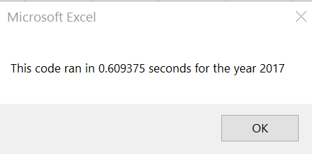
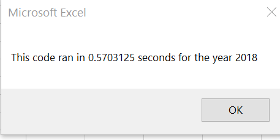
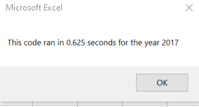
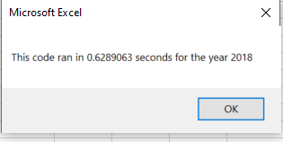

# **Title of stock-analysis**

## **Overview of Project**
### Purpose - Explain the purpose of this analysis.

## **Results**
### Stock Performance Comparison
- Using images and examples of your code, compare the stock performance between 2017 and 2018, 
### Script Execution Time
  - Refactored Script
    - Using images and examples of your code, compare the execution times of the original script and the refactored script make sure links are working!!!!
    
      
      
  
  - Original Script 
    -  blah blah 
  
      
      
  
## **Summary**
### Advantages or Disadvantages of Refactoring Code
- What are the advantages or disadvantages of refactoring code?
  - An Advantage of refactoring might be that the coder is able to improve the efficiency of the code.  
    -  Three examples given in Module 2 of how code can be made more efficient include:  
      > taking fewer steps, using less memory, or improving the logic of the code to make it easier for future users to read.
    -  In this project, the refactoring made the result return slightly faster than the original.
  - Possible disadvantages might be the opposite of what was just mentioned.  If you are not the original author of the code, you may spend more time attempting to become familiar with the code or you may not have the background.  Perhaps the original coder might have scripted the code in what appears to be a more efficient way, and it didn't create the same output.
### Application of Refactoring Original Script
- How do these pros and cons apply to refactoring the original VBA script?
